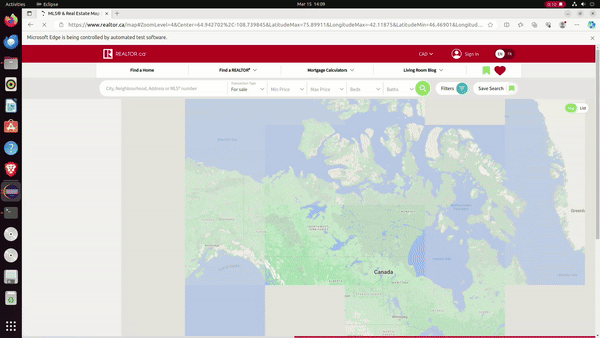

# Propertico - A web scrapper to find Houses and make a database

# Work Flow

1.  Take input from CSV File
2.  Clean and find Cities to scrape data for
3.  Scrape Data on Realtor.com, Zolo.ca and Royallepage.ca
4.  Make a .DAT file (JAVA object format)
5.  Perform Anaylsis on that data 

# Videos

* [Crawling](https://drive.google.com/file/d/1lV3i_bc-kR8-vyS2dqRnAZj9pyAg6wOD/view?usp=sharing)

* [Implementation](https://drive.google.com/file/d/1I5MTI46RI41jcpyCqF4N7buPVvxQhlR3/view?usp=sharing)

# Key Modules

* Web Crawler
* HTML Parser
* Data Validation using Regular Expression 
* Spell Checking
* Word Completion
* Inverted Indexing
* Search Frequency
* Frequency Counter
* Page Ranking
* Pattern matching using Regular Expression

